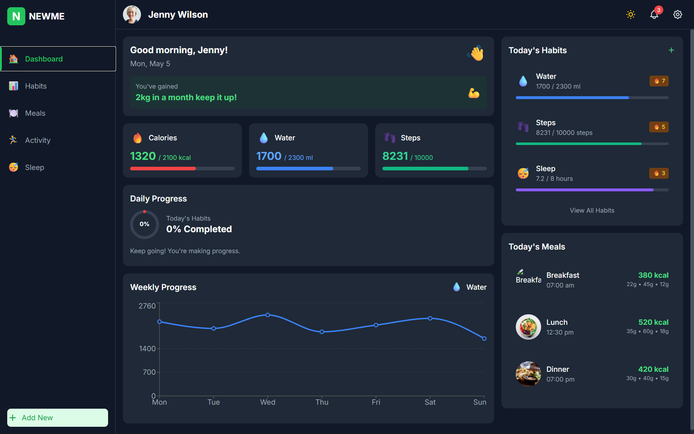

# NEWME Health Tracker

A modern, feature-rich health and habit tracking application built with Next.js, TypeScript, and Tailwind CSS.



## Features

- 📊 Comprehensive habit tracking with progress visualization
- 🍽️ Meal planning and nutrition analysis
- 📈 Detailed progress charts and statistics
- 🌙 Dark/light mode support
- 📱 Fully responsive design
- ✨ Smooth animations using Framer Motion
- 🔄 Real-time progress updates

## Tech Stack

- **Framework**: Next.js 14 with App Router
- **Language**: TypeScript
- **Styling**: Tailwind CSS
- **Charts**: Recharts
- **Animations**: Framer Motion
- **State Management**: React Context API

## Project Structure

```
health-tracker/
├── public/
│   ├── favicon.ico
│   └── logo.png
├── src/
│   ├── app/
│   │   ├── layout.tsx
│   │   └── page.tsx
│   ├── components/
│   │   ├── dashboard/
│   │   ├── habits/
│   │   ├── layout/
│   │   ├── meals/
│   │   ├── modals/
│   │   └── ui/
│   ├── context/
│   ├── data/
│   ├── hooks/
│   ├── types/
│   └── utils/
├── tailwind.config.ts
└── tsconfig.json
```

## Getting Started

### Prerequisites

- Node.js 18.0 or later
- npm or yarn

### Installation

1. Clone the repository:

```bash
git clone https://github.com/Hmtgit7/health-tracker.git
cd health-tracker
```

2. Install dependencies:

```bash
npm install
# or
yarn install
```

3. Run the development server:

```bash
npm run dev
# or
yarn dev
```

4. Open [http://localhost:3000](http://localhost:3000) in your browser to see the application.

## Key Components

### Dashboard

The dashboard provides an overview of your daily health metrics, including:

- Daily habit completion progress
- Calorie, water, and step tracking
- Weekly progress charts
- Quick access to today's meals

### Habit Tracker

Track and manage your daily habits with:

- Visual progress indicators
- Streak tracking for consistent behavior
- Detailed analytics for each habit
- Easy habit creation and management

### Meal Planner

Plan and monitor your nutrition with:

- Meal logging with calorie counting
- Macronutrient breakdown
- Nutritional analysis with charts
- Daily intake recommendations

## Customization

### Themes

The application supports both light and dark modes. The theme automatically adjusts based on user preference but can be manually toggled in the settings.

### Adding New Habits

New habits can be added through the user interface. Each habit can be customized with:

- Name and icon
- Target goal and unit
- Color for visual representation
- Tracking frequency

## License

This project is licensed under the MIT License - see the LICENSE file for details.

## Acknowledgements

- UI design inspired by modern health tracking applications
- Icons and imagery from various free resources
- Built as a frontend developer assignment showcase