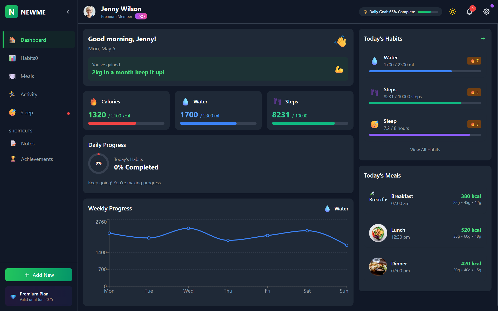
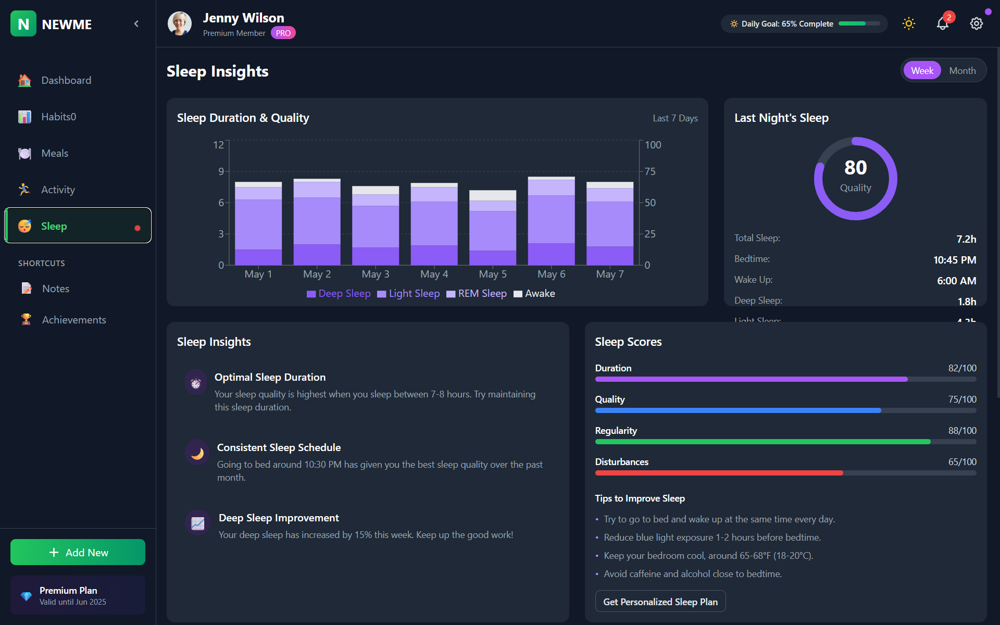

# NEWME Health & Habit Tracker


A modern, feature-rich health and habit tracking application built with Next.js, TypeScript, and Tailwind CSS. NEWME helps users monitor and improve their daily habits, track health metrics, and achieve wellness goals through an intuitive interface and data visualization.

## 🌟 Live Demo

Check out the live application: [NEWME Health Tracker](https://health-tracker-six-beige.vercel.app/)



## ✨ Features

- 📊 **Comprehensive Habit Tracking**: Track daily habits with visual progress indicators and streaks
- 🍽️ **Meal Planning**: Log meals and monitor nutrition with detailed breakdowns
- 📈 **Advanced Analytics**: Visualize your progress with interactive charts and weekly insights
- 💤 **Sleep Tracking**: Monitor sleep patterns and receive quality insights
- 🏃‍♂️ **Activity Monitoring**: Track workouts and physical activities
- 🌓 **Dark/Light Mode**: Choose your preferred theme with seamless transitions
- 📱 **Fully Responsive**: Perfect experience on mobile, tablet, and desktop devices
- 🔔 **Notification System**: Stay informed with personalized alerts and achievements
- 🏆 **Achievement System**: Earn badges and track progress milestones
- 🎯 **Goal Setting**: Set and monitor personal health goals

## 📸 Screenshots

### Dashboard Overview

The main dashboard provides a quick glance at all your health metrics and daily progress.

### Habit Tracking

Monitor your daily habits with intuitive progress bars and achievement streaks.

### Meal Planning

Track your meals and nutrition with detailed macronutrient breakdown.

### Activity Analytics

Visualize your physical activities and workout progress over time.

### Sleep Tracker

Monitor your sleep patterns and quality with detailed insights.

### Dark Mode

Easy on the eyes with a beautiful dark theme option.

### Profile Management

Comprehensive profile management with detailed statistics and achievements.

### Settings Management

Comprehensive settings management with detailed statistics and achievements.

## 🚀 Tech Stack

- **Framework**: [Next.js 14](https://nextjs.org/) with App Router
- **Language**: [TypeScript](https://www.typescriptlang.org/)
- **Styling**: [Tailwind CSS](https://tailwindcss.com/)
- **Animation**: [Framer Motion](https://www.framer.com/motion/)
- **Charts**: [Recharts](https://recharts.org/)
- **State Management**: React Context API
- **Deployment**: [Vercel](https://vercel.com/)

## 📂 Project Structure

```
health-tracker/
├── public/                # Static assets
├── src/
│   ├── app/               # App router pages
│   ├── components/        # UI components
│   │   ├── activity/      # Activity tracking components
│   │   ├── dashboard/     # Dashboard components
│   │   ├── habits/        # Habit tracking components
│   │   ├── layout/        # Layout components (header, sidebar)
│   │   ├── meals/         # Meal tracking components
│   │   ├── modals/        # Modal components
│   │   ├── notifications/ # Notification components
│   │   ├── sleep/         # Sleep tracking components
│   │   └── ui/            # Reusable UI components
│   ├── context/           # React context providers
│   ├── data/              # Mock data
│   ├── hooks/             # Custom React hooks
│   ├── types/             # TypeScript type definitions
│   └── utils/             # Utility functions
├── tailwind.config.ts     # Tailwind configuration
└── tsconfig.json          # TypeScript configuration
```

## 🏁 Getting Started

### Prerequisites

- Node.js 18.0 or later
- npm or yarn

### Installation

1. Clone the repository:

```bash
git clone https://github.com/Hmtgit7/health-tracker.git
cd health-tracker
```

2. Install dependencies:

```bash
npm install
# or
yarn install
```

3. Run the development server:

```bash
npm run dev
# or
yarn dev
```

4. Open [http://localhost:3000](http://localhost:3000) in your browser to see the application.

## 🎨 Key Features Explained

### Interactive Dashboard

The dashboard provides a comprehensive overview of your health metrics, with real-time updates and visually appealing charts that help you understand your progress at a glance.

### Habit Tracking System

Track your daily habits with visual progress indicators, streaks, and achievements. The system provides insights into your consistency and helps you build better habits over time.

### Advanced Meal Planning

Log your meals with detailed nutritional information. The app provides a breakdown of macronutrients and helps you stay on track with your dietary goals.

### Sleep Analytics

Monitor your sleep patterns with detailed insights into sleep quality, duration, and consistency. The app provides recommendations to improve your sleep habits.

### Activity Monitoring

Track your workouts and physical activities with detailed metrics. The app visualizes your activity patterns and helps you stay active.

### Achievement System

Earn badges and achievements as you reach milestones in your health journey. The system provides motivation to keep improving and celebrating your successes.

## 🌐 Browser Support

The application is tested and optimized for the following browsers:

- Chrome (latest)
- Firefox (latest)
- Safari (latest)
- Edge (latest)

## 📱 Mobile Support

The application is fully responsive and works seamlessly on:

- iOS devices (Safari)
- Android devices (Chrome)

## 🛠️ Custom Components

### UI Components

- **Button**: Enhanced button component with multiple variants, animations, and states
- **Card**: Versatile card component with hover effects and glass morphism
- **ProgressBar**: Animated progress bars with various styles and colors
- **Modal**: Accessible modal system with animations and portal rendering

### Feature Components

- **HabitTracker**: Comprehensive habit tracking with progress visualization
- **MealPlan**: Detailed meal planning and nutrition tracking
- **ActivityAnalytics**: Advanced activity visualization and analytics
- **SleepTracker**: Detailed sleep tracking and insights
- **NotificationPanel**: Interactive notification system with different categories

## 🤝 Contributing

Contributions are welcome! Please feel free to submit a Pull Request.

1. Fork the project
2. Create your feature branch (`git checkout -b feature/amazing-feature`)
3. Commit your changes (`git commit -m 'Add some amazing feature'`)
4. Push to the branch (`git push origin feature/amazing-feature`)
5. Open a Pull Request

## 📝 License

This project is licensed under the MIT License - see the LICENSE file for details.

## 👨‍💻 Author

- **Sachin G** - [Hmtgit7](https://github.com/Hmtgit7)

## 🙏 Acknowledgements

- UI/UX inspired by modern health tracking applications
- Icons from various free resources
- Demo data and images are for demonstration purposes only